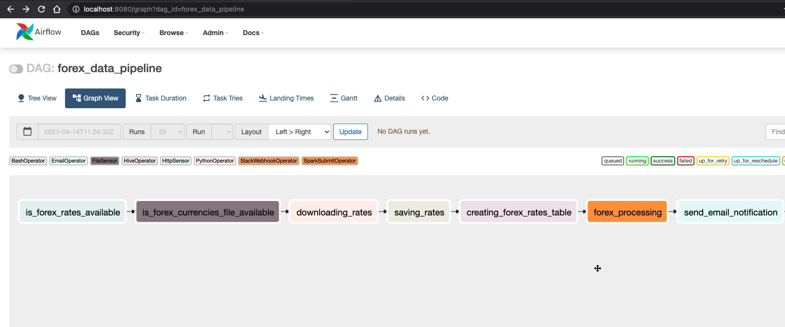

# Forex Data Pipeline Using Apache Airflow
This pipeline get exchange rate from [exchangeratesapi](https://exchangeratesapi.io/), process it and store it in HDFS.




### Setup AirFlow Using Sqlite
* Create directory by name **airflow** - `mkdir airflow`. Get into the directory by running `cd airflow`.
* Create virtual environment - `python -m venv airflow-venv`.
* Activate the virtual environment - `source airflow-env/bin/activate`
* Install AirFlow - `pip install apache-airflow`.
* Run `airflow initdb` to intialize the database and add configuration files. All the databases and configuration files will be created in our working directory **airflow**.
* By default it uses **sqlite** database.
* Run following commands to start airflow webserver and scheduler.
```
airflow webserver -p 8080 -D
airflow scheduler -D
```
* Then you can go to **http://ipaddress:8080**